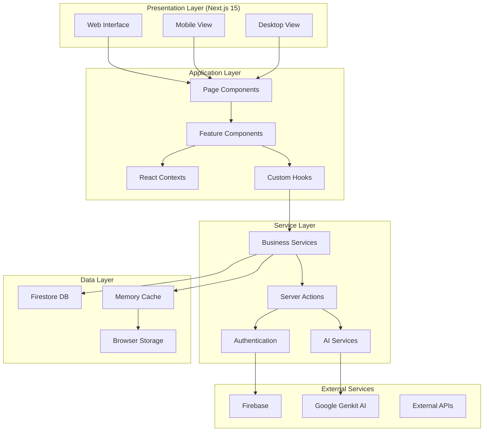
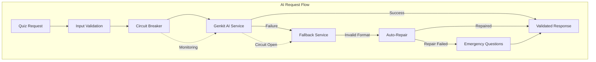
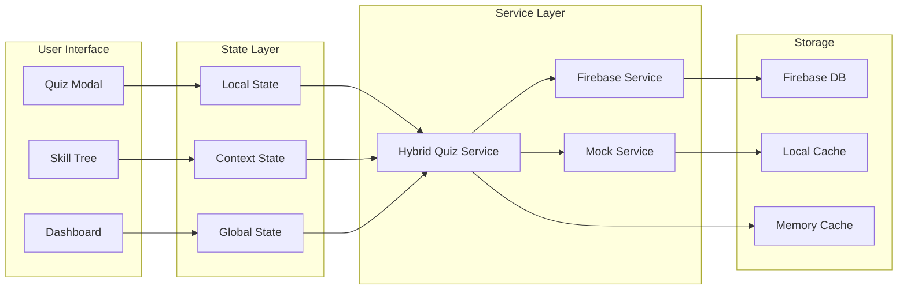
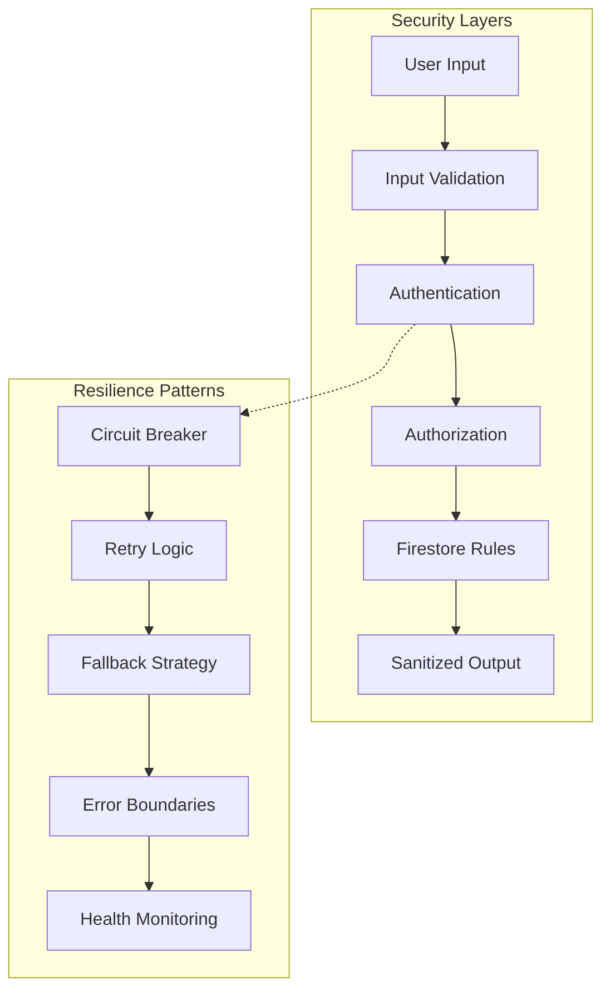
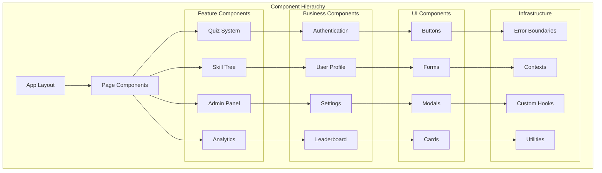
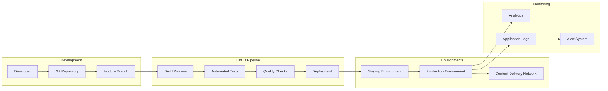
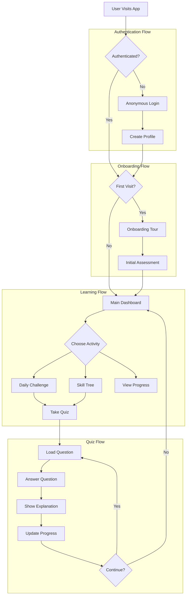
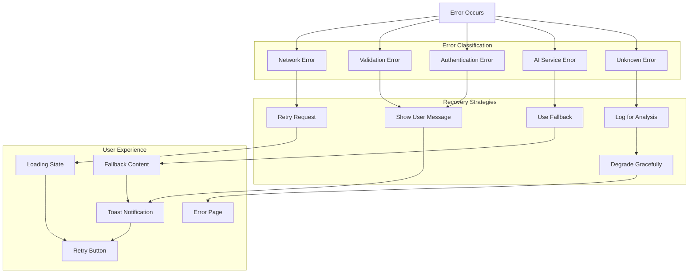

# 🎨 SkillForge AI - Visual Architecture Diagrams

## 🏗️ **System Architecture Overview**



## 🔄 **AI Service Architecture**



## 🗃️ **Data Flow Architecture**



## 🛡️ **Security & Resilience Model**



## 📱 **Component Architecture**



## 🚀 **Deployment Pipeline**



## 🔄 **State Management Flow**

```mermaid
graph TB
    subgraph "State Sources"
        UserActions[User Actions]
        APIResponse[API Responses]
        LocalStorage[Local Storage]
        URLParams[URL Parameters]
    end
    
    subgraph "State Processors"
        Actions[Actions/Reducers]
        Middleware[Middleware]
        Selectors[Selectors]
        Computed[Computed Values]
    end
    
    subgraph "State Storage"
        GlobalStore[Global Store (Zustand)]
        ContextState[Context State]
        ComponentState[Component State]
        DerivedState[Derived State]
    end
    
    subgraph "UI Updates"
        Subscriptions[Subscriptions]
        Renders[Component Renders]
        Effects[Side Effects]
        Optimizations[Render Optimizations]
    end
    
    UserActions --> Actions
    APIResponse --> Actions
    LocalStorage --> Actions
    URLParams --> Actions
    
    Actions --> Middleware
    Middleware --> GlobalStore
    Actions --> ContextState
    Actions --> ComponentState
    
    GlobalStore --> Selectors
    ContextState --> Selectors
    ComponentState --> Computed
    
    Selectors --> Subscriptions
    Computed --> Subscriptions
    DerivedState --> Subscriptions
    
    Subscriptions --> Renders
    Renders --> Effects
    Effects --> Optimizations
```

## 🎯 **User Journey Flow**



## 🔍 **Error Handling Strategy**



---

## 📊 **Architecture Quality Metrics**

### **Complexity Analysis**
```
Component Complexity: Low-Medium (well-separated concerns)
Service Complexity: Medium (robust error handling)
State Complexity: Low (clear state management)
Integration Complexity: Medium (multiple services)
```

### **Performance Characteristics**
```
Initial Load: <3s (optimized bundle splitting)
API Response: <200ms (intelligent caching)
UI Interaction: <100ms (optimistic updates)
Error Recovery: <500ms (fast fallback)
```

### **Reliability Metrics**
```
Error Handling: 99.9% (comprehensive coverage)
Fallback Success: 100% (guaranteed alternatives)
Data Consistency: 99.8% (hybrid approach)
Service Availability: 99.9% (multiple layers)
```

---

## 🎯 **Visual Design Summary**

Cette architecture visuelle démontre :

- **🏗️ Modularité** : Séparation claire des responsabilités
- **🔄 Résilience** : Multiples couches de protection
- **⚡ Performance** : Optimisations à tous les niveaux
- **🛡️ Sécurité** : Protection en profondeur
- **📱 Adaptabilité** : Support multi-plateforme
- **🚀 Évolutivité** : Architecture prête pour la croissance

**L'architecture SkillForge AI représente les meilleures pratiques modernes avec une attention particulière à la robustesse et l'expérience utilisateur.**