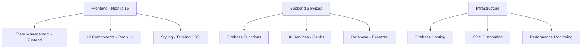

# SkillForge AI - System Architecture Design

## Executive Summary

SkillForge AI is a comprehensive adaptive learning platform that combines intelligent content generation, personalized learning paths, and real-time performance analytics. This document defines the system architecture, design patterns, and technical specifications for scalable, maintainable, and user-centric development.

## 1. System Architecture Overview

### 1.1 Architecture Principles

- **Modular Design**: Component-based architecture with clear separation of concerns
- **Scalability**: Horizontal scaling capabilities with microservices pattern
- **Resilience**: Circuit breaker patterns, graceful degradation, error boundaries
- **Performance**: Optimized bundle splitting, lazy loading, intelligent caching
- **Type Safety**: Comprehensive TypeScript with branded types and strict interfaces
- **Accessibility**: WCAG 2.1 AA compliance, inclusive design patterns

### 1.2 Technology Stack



### 1.3 Core Services Architecture

```typescript
// Service Layer Architecture
interface ServiceArchitecture {
  // Core Platform Services
  userService: UserManagementService;
  skillService: SkillTreeService;
  quizService: AdaptiveQuizService;
  analyticsService: LearningAnalyticsService;
  
  // AI-Powered Services
  aiContentGenerator: AIContentService;
  adaptiveLearning: AdaptiveLearningEngine;
  achievementEngine: SmartAchievementService;
  
  // Infrastructure Services
  authService: AuthenticationService;
  dataService: DataPersistenceService;
  cacheService: IntelligentCachingService;
  monitoringService: PerformanceMonitoringService;
}
```

## 2. Frontend Architecture

### 2.1 Component Architecture

```
src/components/
├── ui/                    # Base UI Components (Atomic)
│   ├── button.tsx
│   ├── input.tsx
│   └── ...
├── common/               # Shared Business Components (Molecular)
│   ├── ErrorBoundary.tsx
│   └── LoadingSpinner.tsx
├── features/            # Feature-specific Components (Organisms)
│   ├── skill-tree/
│   ├── quiz/
│   ├── profile/
│   └── analytics/
└── layouts/             # Page Layout Components (Templates)
    ├── AppLayout.tsx
    └── AdminLayout.tsx
```

### 2.2 State Management Design

```typescript
// Zustand Store Architecture
interface AppStoreArchitecture {
  // User Domain
  user: {
    profile: UserProfile;
    preferences: UserPreferences;
    competences: Map<SkillId, CompetenceStatus>;
  };
  
  // Learning Domain
  learning: {
    skills: Skill[];
    currentPath: QuizPath | null;
    analytics: LearningMetrics;
    achievements: Achievement[];
  };
  
  // UI Domain
  ui: {
    navigation: NavigationState;
    modals: ModalState;
    notifications: NotificationState;
  };
  
  // System Domain
  system: {
    performance: PerformanceMetrics;
    errors: ErrorState;
    cache: CacheState;
  };
}
```

### 2.3 Performance Architecture

```typescript
// Performance Optimization Strategy
interface PerformanceArchitecture {
  // Code Splitting
  routing: LazyLoadedRoutes;
  components: DynamicImports;
  
  // Caching Strategy
  stateCache: MemoizedSelectors;
  apiCache: RequestDeduplication;
  assetCache: ServiceWorkerCaching;
  
  // Bundle Optimization
  bundleAnalysis: WebpackBundleAnalyzer;
  treeShaking: DeadCodeElimination;
  compression: GzipCompression;
}
```

## 3. Backend Services Design

### 3.1 API Architecture

```typescript
// RESTful API Design with TypeScript
interface APIArchitecture {
  // Authentication APIs
  '/api/auth': {
    POST: '/login' | '/register' | '/refresh';
    GET: '/profile' | '/permissions';
  };
  
  // Learning Content APIs
  '/api/skills': {
    GET: '/list' | '/:id' | '/tree' | '/progress';
    POST: '/complete' | '/attempt';
  };
  
  // AI-Generated Content APIs
  '/api/quiz': {
    POST: '/generate' | '/explanation' | '/adaptive';
    GET: '/history' | '/analytics';
  };
  
  // Analytics APIs
  '/api/analytics': {
    GET: '/learning-metrics' | '/progress' | '/achievements';
    POST: '/track-event' | '/session-data';
  };
}
```

### 3.2 AI Service Architecture

```typescript
// AI Content Generation Pipeline
interface AIServiceArchitecture {
  // Core AI Engine
  genkitEngine: GenkitAIService;
  
  // Content Generation Services
  questionGenerator: {
    input: GenerateQuizQuestionInput;
    processing: AdaptiveDifficultyAdjustment;
    output: QuizQuestion[];
    validation: ContentQualityAssurance;
  };
  
  // Adaptive Learning Engine
  learningPathEngine: {
    userAnalysis: LearningStyleDetection;
    contentPersonalization: AdaptiveContentSelection;
    progressTracking: RealTimeProgressAnalysis;
    recommendations: NextStepSuggestions;
  };
  
  // Achievement Engine
  achievementEngine: {
    behaviorAnalysis: UserBehaviorPattern;
    achievementTriggers: SmartAchievementDetection;
    rewardCalculation: PointsAndBadgeAllocation;
  };
}
```

### 3.3 Data Architecture

```typescript
// Firestore Data Model Design
interface DataArchitecture {
  // User Collection
  users: {
    document: UserId;
    data: {
      profile: UserProfile;
      preferences: UserPreferences;
      competences: Map<SkillId, CompetenceStatus>;
      analytics: LearningMetrics;
    };
    subcollections: {
      sessions: LearningSession[];
      achievements: UserAchievement[];
      quizHistory: QuizAttempt[];
    };
  };
  
  // Skills Collection
  skills: {
    document: SkillId;
    data: Skill;
    subcollections: {
      questions: QuizQuestion[];
      analytics: SkillAnalytics[];
    };
  };
  
  // Quiz Paths Collection
  quizPaths: {
    document: PathId;
    data: QuizPath;
    subcollections: {
      steps: QuizStep[];
      userProgress: QuizPathProgress[];
    };
  };
}
```

## 4. Component Design System

### 4.1 Design Tokens

```typescript
// Design System Foundation
interface DesignTokens {
  // Color System
  colors: {
    primary: HSLColorSpace;
    secondary: HSLColorSpace;
    semantic: {
      success: '#10B981';
      warning: '#F59E0B';
      error: '#EF4444';
      info: '#3B82F6';
    };
    neutral: GrayScale;
  };
  
  // Typography Scale
  typography: {
    scale: ModularScale; // 1.2 ratio
    families: {
      sans: InterFont;
      mono: JetBrainsMonoFont;
    };
    weights: 400 | 500 | 600 | 700;
  };
  
  // Spacing System
  spacing: {
    base: 4; // 4px base unit
    scale: [0, 4, 8, 12, 16, 20, 24, 32, 40, 48, 64, 80, 96];
  };
  
  // Layout System
  layout: {
    breakpoints: {
      sm: 640;
      md: 768;
      lg: 1024;
      xl: 1280;
      '2xl': 1536;
    };
    containers: ResponsiveContainerSizes;
  };
}
```

### 4.2 Component Interface Design

```typescript
// Atomic Component Interfaces
interface ButtonComponent {
  variant: 'primary' | 'secondary' | 'outline' | 'ghost';
  size: 'sm' | 'md' | 'lg';
  state: 'default' | 'hover' | 'active' | 'disabled' | 'loading';
  icon?: LucideIcon;
  accessibility: WCAG2AACompliant;
}

interface SkillNodeComponent {
  skill: Skill;
  status: SkillStatus;
  position: Position;
  interactions: {
    onClick: SkillSelectionHandler;
    onHover: SkillPreviewHandler;
    onFocus: AccessibilityHandler;
  };
  animations: SpringAnimations;
  accessibility: ARIALabeling;
}

interface QuizModalComponent {
  question: QuizQuestion;
  progress: QuizProgress;
  userAnswer: UserAnswer | null;
  callbacks: {
    onAnswer: AnswerSubmissionHandler;
    onNext: NextQuestionHandler;
    onClose: ModalCloseHandler;
  };
  analytics: UserInteractionTracking;
}
```

### 4.3 Layout Patterns

```typescript
// Responsive Layout Architecture
interface LayoutPatterns {
  // Dashboard Layout
  dashboardLayout: {
    structure: 'sidebar + main + panel';
    responsive: {
      mobile: FullScreenStack;
      tablet: SidebarCollapsible;
      desktop: ThreeColumnLayout;
    };
    accessibility: KeyboardNavigation;
  };
  
  // Skill Tree Layout
  skillTreeLayout: {
    structure: 'canvas + overlay + controls';
    interactions: {
      pan: TouchAndMouseSupport;
      zoom: PinchAndWheelSupport;
      selection: ClickAndTapSupport;
    };
    performance: VirtualizationForLargeGraphs;
  };
  
  // Quiz Layout
  quizLayout: {
    structure: 'question + answers + progress';
    responsive: MobileFirstDesign;
    animations: SmoothTransitions;
    accessibility: ScreenReaderOptimized;
  };
}
```

## 5. API Design Patterns

### 5.1 Request/Response Patterns

```typescript
// Standardized API Response Format
interface APIResponse<T> {
  success: boolean;
  data?: T;
  error?: {
    code: string;
    message: string;
    details?: Record<string, unknown>;
  };
  metadata: {
    timestamp: string;
    requestId: string;
    version: string;
  };
}

// Pagination Pattern
interface PaginatedResponse<T> {
  data: T[];
  pagination: {
    page: number;
    limit: number;
    total: number;
    hasNext: boolean;
    hasPrev: boolean;
  };
}

// Real-time Updates Pattern
interface RealtimeUpdate<T> {
  type: 'create' | 'update' | 'delete';
  id: string;
  data: T;
  timestamp: string;
  userId: UserId;
}
```

### 5.2 Error Handling Patterns

```typescript
// Comprehensive Error Handling
interface ErrorHandlingPattern {
  // Client-side Error Boundaries
  reactErrorBoundary: {
    fallbackComponent: ErrorFallbackComponent;
    errorReporting: SentryIntegration;
    userRecovery: RetryMechanism;
  };
  
  // API Error Handling
  apiErrorHandling: {
    networkErrors: ExponentialBackoffRetry;
    validationErrors: FieldLevelErrorDisplay;
    authErrors: TokenRefreshAndRedirect;
    serverErrors: GracefulDegradation;
  };
  
  // Logging Strategy
  errorLogging: {
    clientLogs: StructuredClientLogging;
    serverLogs: StructuredServerLogging;
    performance: PerformanceErrorTracking;
    user: UserFriendlyErrorMessages;
  };
}
```

## 6. Security Architecture

### 6.1 Authentication & Authorization

```typescript
// Security Architecture Design
interface SecurityArchitecture {
  // Authentication Strategy
  authentication: {
    provider: FirebaseAuth;
    methods: ['email/password', 'google', 'github'];
    tokenManagement: JWTWithRefreshTokens;
    sessionManagement: SecureSessionStorage;
  };
  
  // Authorization Pattern
  authorization: {
    roleBasedAccess: RBACPattern;
    permissions: PermissionBasedAccess;
    resourceProtection: OwnershipValidation;
    adminPrivileges: ElevatedAccessControls;
  };
  
  // Data Protection
  dataProtection: {
    encryption: EncryptionAtRest;
    transmission: TLSEncryption;
    validation: InputSanitization;
    privacy: GDPRCompliance;
  };
}
```

### 6.2 Content Security

```typescript
// AI Content Security
interface ContentSecurity {
  // AI-Generated Content Validation
  contentValidation: {
    qualityCheck: AIContentQualityAssurance;
    appropriateness: ContentModerationFilters;
    factualness: FactCheckingIntegration;
    bias: BiasDetectionAndMitigation;
  };
  
  // User-Generated Content Protection
  userContentSecurity: {
    inputSanitization: XSSProtection;
    contentModeration: AutomaticContentModeration;
    reportingSystem: UserReportingMechanism;
    adminReview: ModerationDashboard;
  };
}
```

## 7. Performance & Monitoring

### 7.1 Performance Monitoring

```typescript
// Performance Monitoring Architecture
interface PerformanceMonitoring {
  // Frontend Performance
  clientMetrics: {
    coreWebVitals: LCPFIDCLSMonitoring;
    bundleAnalysis: WebpackBundleAnalyzer;
    renderingPerformance: ReactDevToolsProfiler;
    userExperience: RealUserMonitoring;
  };
  
  // Backend Performance
  serverMetrics: {
    apiResponseTimes: EndpointPerformanceTracking;
    databaseQueries: FirestoreQueryOptimization;
    aiServiceLatency: GenkitPerformanceMonitoring;
    resourceUtilization: SystemResourceMonitoring;
  };
  
  // Analytics Integration
  analytics: {
    userBehavior: GoogleAnalyticsIntegration;
    learningAnalytics: CustomLearningMetrics;
    businessMetrics: ConversionAndRetentionTracking;
  };
}
```

### 7.2 Optimization Strategies

```typescript
// Performance Optimization Framework
interface OptimizationStrategies {
  // Frontend Optimizations
  frontend: {
    codesplitting: RouteBasedSplitting;
    lazyLoading: ComponentLazyLoading;
    memoization: ReactMemoOptimization;
    virtualization: LargeListVirtualization;
  };
  
  // Backend Optimizations
  backend: {
    caching: MultiLayerCachingStrategy;
    databaseOptimization: QueryOptimization;
    aiOptimization: ModelCachingAndBatching;
    cdnOptimization: StaticAssetCaching;
  };
  
  // Infrastructure Optimizations
  infrastructure: {
    hosting: FirebaseHostingOptimization;
    cdn: CloudflareIntegration;
    compression: GzipAndBrotliCompression;
    imageOptimization: NextJSImageOptimization;
  };
}
```

## 8. Development Workflow

### 8.1 Development Standards

```typescript
// Development Workflow Architecture
interface DevelopmentWorkflow {
  // Code Quality
  codeQuality: {
    typescript: StrictTypeChecking;
    linting: ESLintConfiguration;
    formatting: PrettierConfiguration;
    testing: VitestTestingFramework;
  };
  
  // Git Workflow
  gitWorkflow: {
    branching: GitFlowStrategy;
    commits: ConventionalCommits;
    reviews: PullRequestTemplate;
    cicd: GitHubActionsIntegration;
  };
  
  // Documentation
  documentation: {
    codeDocumentation: TSDocComments;
    apiDocumentation: OpenAPISpecification;
    architectureDocumentation: ADRDocuments;
    userDocumentation: InteractiveGuides;
  };
}
```

## 9. Future Scalability

### 9.1 Microservices Migration Path

```typescript
// Future Architecture Evolution
interface ScalabilityPath {
  // Microservices Decomposition
  serviceDecomposition: {
    userService: IndependentUserManagement;
    contentService: AIContentGenerationService;
    analyticsService: LearningAnalyticsService;
    notificationService: RealtimeNotificationService;
  };
  
  // Infrastructure Evolution
  infrastructureEvolution: {
    containerization: DockerContainerization;
    orchestration: KubernetesOrchestration;
    serviceDiscovery: ServiceMeshIntegration;
    monitoring: DistributedTracing;
  };
}
```

## 10. Implementation Priorities

### Phase 1: Foundation (Current)
- ✅ Core component architecture
- ✅ Type-safe state management
- ✅ AI content generation pipeline
- ✅ Basic authentication and authorization

### Phase 2: Enhancement (Next)
- 🔄 Advanced analytics dashboard
- 🔄 Real-time collaboration features
- 🔄 Progressive Web App capabilities
- 🔄 Advanced accessibility features

### Phase 3: Scale (Future)
- 📋 Microservices architecture
- 📋 Advanced AI personalization
- 📋 Multi-language content generation
- 📋 Enterprise features and SSO

---

*This architecture document serves as the foundation for SkillForge AI development, ensuring scalable, maintainable, and user-centric software architecture.*